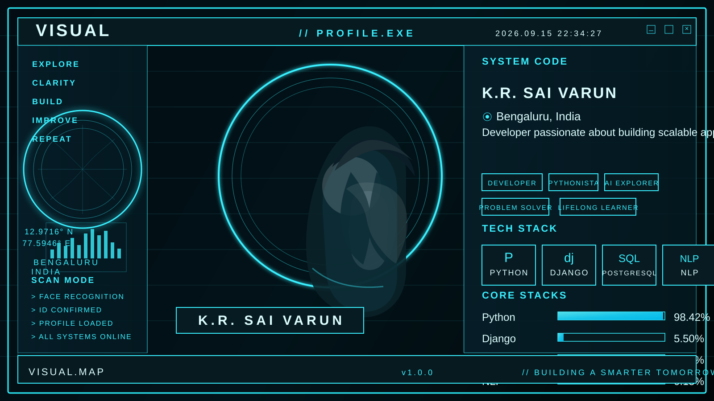

  <picture>
    <source media="(prefers-color-scheme: dark)" srcset="./dark.svg">
    <source media="(prefers-color-scheme: light)" srcset="./light.svg">
    
  </picture>

---

## 👨‍💻 About Me

I build **scalable full-stack applications** focused on performance, security, and real-world usability. My work spans **booking systems**, **AI-driven tools**, and **data dashboards** — delivering clean architecture and optimized backend logic that solves actual problems.

- 🎓 **BCA Graduate** · Pursuing **MCA** in Bengaluru, India
- 🛠 Experienced with the full product lifecycle — schema design → deployed UI
- 🤖 Actively exploring **Machine Learning & NLP** to build smarter applications
- 💡 I don't just learn tech — I ship it

---

## 🎯 Why Work With Me

| | |
|---|---|
| ✅ **Production Mindset** | I build for scale and real users, not just demos |
| ✅ **Full-Stack Depth** | Confident from database design to polished React UI |
| ✅ **Impact-Driven** | 45% query speedup · 92% AI accuracy · 500+ simulated bookings |
| ✅ **Fast Executor** | Rapid learner who ships projects end-to-end independently |
| ✅ **Security Aware** | JWT auth, vulnerability scanning, secure API design built-in |

---

## 🏆 Key Metrics

| Metric | Value |
|---|---|
| Query Speedup | **45%** |
| AI Accuracy | **92%** |
| Test Bookings | **500+** |
| Training Hours | **400+** |

---

## 🧠 Core Expertise
